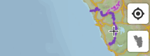

## 🎯 Live location

- Click <button class="geolocate">Geolocate</button> to allow the map to access your device location using GPS.
- Clicking the GPS control again allows locking the device movement with the map. 

## Other 

**Zoom and Pan**: Use scroll to zoom in and out. Click and drag to move around the map. 

**Layer Controls**: Use the `Layer List` to toggle different map layers on and off.

**Search**: Look for specific locations using the search functionality in the top navigation.

**Menu**: Use the `Layer List` to toggle different map layers on and off.
