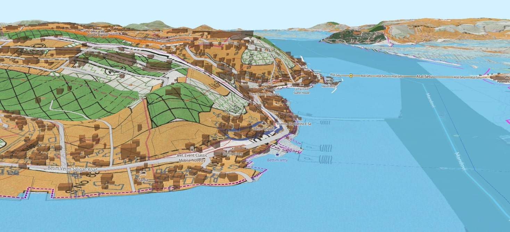

## Introduction 

This is a 3D atlas to explore various layers of [Goa's](https://en.wikipedia.org/wiki/Goa) geography, development, and community resources on a map.

This is a free and open source tool built with community resources. Please see the [amche-atlas project](https://github.com/publicmap/amche-atlas/tree/main) for details.

## Available Data Layers

Some of the maps available on amche atlas:

**Boundaries**
- Cadastral plots with survey and subdivisions
- Municipal wards
- Urban and rural local bodies
- Assembly and parliamentary constituencies
- Revenue village, taluk, district and state boundaries
- Pincodes
- Micro watersheds

**Regulatory Maps**
- TCP land zoning maps: regional plan and outline development plans
- CRZ coastal zoning maps: coastal zone management plan and regulatory limits, fishing zones and wards
- Protected areas: reserve forests, private forests, notified khazans and wetlands, salt pans, heritage sites,  and zones

**Hazards and disaster management**
- Slope zoning: regulated development slopes and no development slopes
- Landslide risk 

**Physical layers**
- Drainage: rivers, streams and canals

## Interactive Features

**Interactive Elements**: Click on map features to view detailed information and attributes.

**Layer Opacity**: Adjust the transparency of layers to see multiple datasets simultaneously.

**Permalinks**: Share specific map views with others using generated URLs.

**Mobile Friendly**: The map works on both desktop and mobile devices for field use.

