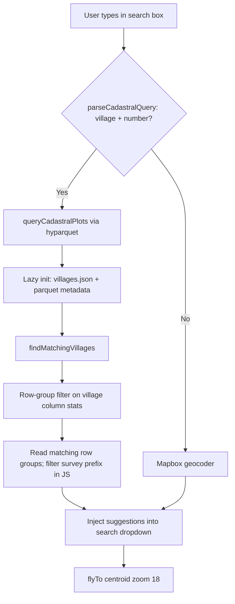

# Goa Cadastral Plot Search

Statewide search for Goa cadastral plots by **village + survey number** (e.g. `Verlem 1/2-A`) from the main map search box. Closes [amche-atlas #234](https://github.com/publicmap/amche-atlas/issues/234).

There is **no backend** — lookup runs in the browser against a pre-built Parquet file using [hyparquet](https://github.com/hyparam/hyparquet).

## User experience

The existing Mapbox search control is extended; there is no separate “Go to” modal.

| User types | Parquet queried? | What appears |
| ---------- | ---------------- | ------------ |
| `verlem` | No | Mapbox places only |
| `verlem 1` | Yes | Cadastral plot suggestions (then Mapbox below) |
| `verlem 1/2-A` | Yes | Narrower plot matches |

Cadastral suggestions use labels like **Verlem — Survey 1/2-A — SANGUEM** (village, survey/subdiv, taluka). Selecting a result flies the map to the plot centroid at zoom 18.

Survey strings are normalised so `1/2-A`, `1 2-A`, and `1-2A` all match the same plots.

Village names tolerate typos via prefix match, then [Levenshtein](https://www.npmjs.com/package/fast-levenshtein) distance ≤ 1 (short names) or ≤ 2.

## Architecture



### Code

| File | Role |
| ---- | ---- |
| `js/cadastral-search.js` | Configurable URLs, parquet init, village fuzzy match, plot query |
| `js/map-search-control.js` | Triggers parquet search when input matches cadastral pattern |
| `js/map-init.js` | Configures and pre-warms cadastral search when atlas defines `cadastralSearch` |
| `config/goa.atlas.json` | `cadastralSearch.parquetUrl` and `cadastralSearch.villagesUrl` |

Data files are hosted externally in [ourgoaindata/cadastral-search](https://github.com/ourgoaindata/cadastral-search) (~3.4 MB parquet, ~426 villages). amche-atlas does not bundle them.

### Atlas configuration

Goa atlas enables search via:

```json
"cadastralSearch": {
  "parquetUrl": "https://raw.githubusercontent.com/ourgoaindata/cadastral-search/v1.0.0/data/cadastral_search.parquet",
  "villagesUrl": "https://raw.githubusercontent.com/ourgoaindata/cadastral-search/v1.0.0/data/villages.json"
}
```

Pre-warm and search run only when the active atlas defines both URLs. Other atlases never fetch cadastral data.

### Dependencies

- `hyparquet` — Parquet reader with HTTP range requests
- `hyparquet-compressors` — ZSTD decompression (file is ZSTD level 22)
- `fast-levenshtein` — village typo tolerance

## Data pipeline

Parquet is generated from Goa OneMap cadastral GeoJSONL in the **amche-utils** repository:

```
goa_cadastral_raw_onemap_gos.geojsonl  (~828k plots)
        │
        ▼
convert_to_search_parquet.py
        │
        ▼
cadastral_search.parquet  (3.4 MB)
        │
        ▼
ourgoaindata/cadastral-search  (tagged release, e.g. v1.0.0)
        │
        ▼
goa.atlas.json cadastralSearch URLs
```

Schema (6 columns): `taluka`, `village`, `survey`, `subdiv`, `lon`, `lat` — centroids only, no geometry.

Design rationale: see [CADASTRAL_SEARCH_PARQUET.md](https://github.com/publicmap/amche-utils/blob/main/CADASTRAL_SEARCH_PARQUET.md) in the utils repo.

### Regenerate and publish new data

```bash
# 1. Build parquet (utils repo)
cd path/to/amche-utils
source venv/bin/activate
python convert_to_search_parquet.py

# 2. Copy into cadastral-search repo and tag a new release
cp cadastral_data_parquet/cadastral_search.parquet path/to/cadastral-search/data/
python export_villages_json.py --output path/to/cadastral-search/data/villages.json
cd path/to/cadastral-search
git add data/
git commit -m "Update cadastral search data"
git tag v1.x.x && git push origin main --tags

# 3. Bump URLs in amche-atlas config/goa.atlas.json to @v1.x.x
```

## Query behaviour

**Parse** (frontend): village name followed by a digit — `^([a-zA-Z\s]+?)\s+([\d].*)$`

**Survey matching:** the query is split on `/` into separate survey and subdiv segments (e.g. `1/2-A` → survey `1`, subdiv `2a`). Each segment is matched against its own parquet column — not concatenated into one string.

**Village matching:** prefix on `villages.json`, else Levenshtein ≤ 1 (query length ≤ 4) or ≤ 2.

**Parquet read:** for each candidate village, row groups are selected using Parquet `village` column min/max statistics, then rows are filtered and ranked in JS. Up to 200 candidates are scored; exact survey match ranks highest, shorter survey numbers beat longer prefix matches (`1` beats `101`), exact subdiv beats subdiv prefix (`1/1` beats `1/11`). At most 5 results are returned.

Duplicate village names across talukas (e.g. Verlem in Sanguem and Quepem) appear as separate suggestions distinguished by taluka in the label.

## Deployment notes

- Both assets are served from GitHub raw at a pinned tag (`v1.0.0`). Do not use jsDelivr for the parquet — hyparquet requires byte-accurate range reads and jsDelivr corrupts the file footer.
- Bump the tag in `goa.atlas.json` when cadastral-search data is updated.
- First visit on Goa atlas: background pre-warm downloads ~3.4 MB parquet + ~20 KB villages list (browser-cached afterward).
- hyparquet uses HTTP range requests — typically only relevant row groups are fetched per search.

## Testing

1. Open Goa atlas (`?atlas=goa`) — Network tab should fetch parquet/villages from GitHub raw after map load.
2. Search box: type `Verlem 1/2` — cadastral suggestions appear above Mapbox results.
3. Select a suggestion — map flies to plot, zoom 18.
4. Typo test: `verlam 1/2` should still match Verlem plots.
5. Village-only `verlem` — no parquet query; Mapbox only.
6. Non-Goa atlas (e.g. `?atlas=india`) — no cadastral parquet fetch.

Push branch to `dev` for live preview: `git push origin HEAD:dev --force` → https://amche.in/dev/
