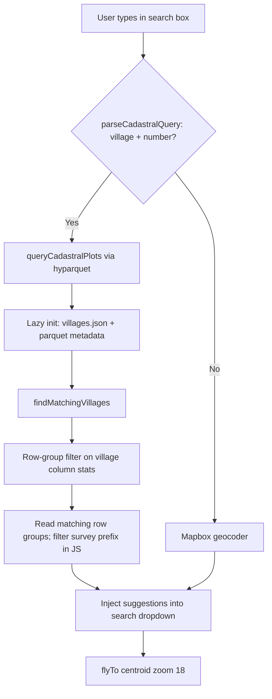

# Goa Cadastral Plot Search

Statewide search for Goa cadastral plots by **village + survey number** (e.g. `Verlem 1/2-A`) from the main map search box. Closes [amche-atlas #234](https://github.com/publicmap/amche-atlas/issues/234).

There is **no backend** — lookup runs in the browser against a pre-built Parquet file using [hyparquet](https://github.com/hyparam/hyparquet).

## User experience

The existing Mapbox search control is extended; there is no separate “Go to” modal.

| User types | Parquet queried? | What appears |
| ---------- | ---------------- | ------------ |
| `verlem` | No | Mapbox places only |
| `verlem 1` | Yes | Cadastral plot suggestions (then Mapbox below) |
| `verlem 1/2-A` | Yes | Narrower plot matches |

Cadastral suggestions use labels like **Verlem — Survey 1/2-A — SANGUEM** (village, survey/subdiv, taluka). Selecting a result flies the map to the plot centroid at zoom 18.

Survey strings are normalised so `1/2-A`, `1 2-A`, and `1-2A` all match the same plots.

Village names tolerate typos via prefix match, then [Levenshtein](https://www.npmjs.com/package/fast-levenshtein) distance ≤ 1 (short names) or ≤ 2.

## Architecture



### Code

| File | Role |
| ---- | ---- |
| `js/cadastral-search.js` | Parquet init, village fuzzy match, plot query, label formatting |
| `js/map-search-control.js` | Triggers parquet search when input matches cadastral pattern |
| `js/map-init.js` | Calls `prewarmCadastral()` after map load to hide cold-start latency |
| `public/data/cadastral_search.parquet` | ~3.4 MB, ~828k plot centroids (built in [amche/utils](https://github.com/publicmap/amche-utils)) |
| `public/data/villages.json` | Distinct `{ village, taluka }` pairs for fuzzy matching (~426 entries) |

Vite copies `public/data/*` → `dist/data/` (see `vite.config.mjs`). Runtime URLs are `/data/cadastral_search.parquet` and `/data/villages.json`.

### Dependencies

- `hyparquet` — Parquet reader with HTTP range requests
- `hyparquet-compressors` — ZSTD decompression (file is ZSTD level 22)
- `fast-levenshtein` — village typo tolerance

## Data pipeline (utils repo)

Parquet is generated from Goa OneMap cadastral GeoJSONL in the **amche/utils** repository:

```
goa_cadastral_raw_onemap_gos.geojsonl  (~828k plots)
        │
        ▼
convert_to_search_parquet.py
        │
        ▼
cadastral_data_parquet/cadastral_search.parquet  (3.4 MB)
```

Schema (6 columns): `taluka`, `village`, `survey`, `subdiv`, `lon`, `lat` — centroids only, no geometry.

Design rationale (single file vs per-village split, FLOAT coords, runtime normalisation): see [CADASTRAL_SEARCH_PARQUET.md](https://github.com/publicmap/amche-utils/blob/main/CADASTRAL_SEARCH_PARQUET.md) in the utils repo.

### Regenerate and refresh app assets

```bash
# 1. Build parquet (utils repo)
cd path/to/amche/utils
source venv/bin/activate
python convert_to_search_parquet.py

# 2. Copy parquet + villages list into amche-atlas
cp cadastral_data_parquet/cadastral_search.parquet ../amche-atlas/public/data/
python export_villages_json.py --atlas-dir ../amche-atlas

# 3. Rebuild / deploy amche-atlas
cd ../amche-atlas
npm run build
```

## Query behaviour

**Parse** (frontend): village name followed by a digit — `^([a-zA-Z\s]+?)\s+([\d].*)$`

**Survey normalisation:**

```javascript
const surveyNorm = surveyRaw.replace(/[^a-z0-9]/gi, '').toLowerCase()
```

**Village matching:** prefix on `villages.json`, else Levenshtein ≤ 1 (query length ≤ 4) or ≤ 2.

**Parquet read:** for each candidate village, row groups are selected using Parquet `village` column min/max statistics, then rows are filtered in JS for exact village name and normalised survey prefix. At most 5 results are returned.

Duplicate village names across talukas (e.g. Verlem in Sanguem and Quepem) appear as separate suggestions distinguished by taluka in the label.

## Deployment notes

- Both files under `public/data/` must be present before `npm run build` (they are copied into `dist/data/`).
- First visit after deploy: background pre-warm downloads ~3.4 MB parquet + ~20 KB villages list (browser-cached afterward).
- hyparquet uses HTTP range requests — typically only relevant row groups are fetched per search.

## Testing

1. `npm run dev` — ensure `public/data/cadastral_search.parquet` and `villages.json` exist.
2. Open Goa atlas, search box: type `Verlem 1/2` — cadastral suggestions should appear above Mapbox results.
3. Select a suggestion — map flies to plot, zoom 18.
4. Typo test: `verlam 1/2` should still match Verlem plots.
5. Village-only `verlem` — no parquet query; Mapbox only.

Push branch to `dev` for live preview: `git push origin HEAD:dev --force` → https://amche.in/dev/
