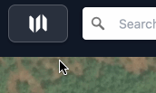
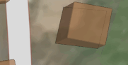
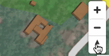
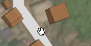
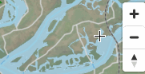

# Atlas controls

## Keyboard shortcuts

### Navigation
- `?` — Open this help page
- `/` — Focus the search box
- `Escape` — Close the current modal or overlay
- `Ctrl+B` — Toggle the map browser
- `Ctrl+L` — Focus the layer controls
- `x` — Toggle the export panel
- `Space` — Center the map on the current selection
- `Arrow Left` / `Arrow Right` — Step through saved markers

### Map navigation
- `Arrow Keys` — Pan the map
- `+` or `=` — Zoom in
- `-` — Zoom out
- `Shift + Arrow Up/Down` — Rotate the map
- `Shift + Arrow Left/Right` — Tilt the map into 3D

### Accessibility
Every interactive element can be reached with `Tab` and `Shift+Tab`, and screen readers are supported throughout the interface.

## Live location

- Click <button class="geolocate">Geolocate</button> to let the map use your device's GPS.
- Click it again to toggle movement lock — the dot keeps updating, but the camera stops following.

## Welcome menu

Open this help page again at any time from the menu, or press `?`.

## Rotate and tilt

**Touch:** press with two fingers and scroll to tilt the camera into 3D.
**Keyboard:** hold `Shift` and press `Left`/`Right`.

**Touch:** rotate with two fingers, or use the rotate control.
**Keyboard:** hold `Shift` and press `Up`/`Down`.

## Move

**Touch:** drag with one finger.
**Mouse:** click and drag.
**Keyboard:** use the arrow keys.

**Touch:** two-finger scroll, or pinch to zoom.
**Mouse:** scroll wheel, or the zoom controls.
**Keyboard:** press `+` to zoom in, `-` to zoom out.

## Layers

Use the layer list to turn map layers on and off, and the search box in the header to jump to a location.
